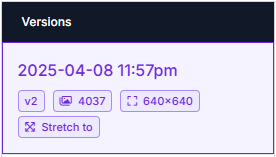

# Detekcja obiektów ruchu drogowego
🤖 Podsumowanie projektu realizowanego w ramach zajęć z **Podstaw Sztucznej Inteligencji**

---

#### ✍️ Autorzy:
- Karol Woda
- Wojciech Zacharski

🎓 Wydział: Inżynierii Materiałowej i Informatyki Przemysłowej\
📘 Kierunek: Informatyka Techniczna\
⏳ Rok: 3\
🔖 Semestr: 6

#### 📆 Data oddania: 12.06.2025

---

## 🎯 Określenie tematu i celu projektu, analiza wymagań

W ramach naszego projektu zdecydowaliśmy się zrealizować problem detekcji obiektów ruchu drogowego. Naszym celem było wytrenowanie a następnie wdrożenie modelu w funkcjonalnej formie.

#### Klasy wykrywanych obiektów:

1. 🚗 samochód (car)
2. 🚛 Ciężarówka (Truck)
3. 🏍️ Motocykl (Motorcycle)
4. ⚠️ Znak ostrzegawczy (Warning Sign)
5. ⛔ Znak zakazu (Prohibition Sign)
6. ⏱️ Znak ograniczenia prędkości (Speed Limit Sign)
7. 🪧 Inny znak (Different Traffic Sign)
8. 🟢 Zielone światło drogowe (Green Traffic Light)
9. 🔴 Czerwone światło drogowe (Red Traffic Light)
10. 🚶‍♂️ Pieszy (Pedestrian)
11. 🚸 Przejście dla pieszych (Pedestrian Crossing)

#### Wymagania:
- ⚡ **Wydajność:** Model nie musi działać w czasie rzeczywistym, ale powinien w sensownym czasie dawać wyniki.
- 🏗️ **Skalowalność:** Model powinien działać lokalnie na podstawie dostarczonych zdjęć.
- 🔒️ **Bezpieczeństwo:** Na zdjęciach nie mogą być widoczne dane wrażliwe (np. numer rejestracyjny, twarz przechodnia itp.).
- 🧮 **Dokładność:** Elementy rozpoznane przez program powinny znajdować się na obrazku.

---

## 🗂️ Zbiór danych i ich przygotowanie

Wybraliśmy zbiór danych dostępny na licencji `Apache 2.0`: [Traffic Road Object Detection Polish 12k](https://www.kaggle.com/datasets/mikoajkoek/traffic-road-object-detection-polish-12k).
Pobraliśmy model, a następnie wykorzystując internetowe narzędzie [Roboflow](https://roboflow.com/brand)
Przygotowaliśmy zbiór danych. Zdjęcia w naszym wybranym datasecie były już pooznaczane od razu w liczbie 4027 zdjęć, jednak by przećwiczyć oznaczanie, postanowiliśmy samodzielnie oznaczyć kilka zdjęć:

Proces oznaczania:

Dalej stworzyliśmy w [Roboflow](https://roboflow.com/brand) nową wersję naszego datasetu, ustalajć proporcję na:
- 88% set treningowy (train set)
- 8% set walidacyjny (valid set)
- 4% set testowy (test set)

Ustaliliśmy by zdjęcia były przeskalowane do rozmiaru 640x640, nie nakładaliśmy żadnych modyfikacji zdjęć, gdyż zauważyliśmy, że orginalny autor datasetu już to zrobił.

---

## ⚙️ Wybór i implementacja modelu AI

Trenowaliśmy model w dwójnasób:
- wykorzystując interfejs [Roboflow](https://roboflow.com/brand)
- wykorzystując internetowe narzędzie [Google Collab](https://colab.google/)
- próbowaliśmy również uczyć model w środowisku lokalnym wykorzystując venv, jednak w wyniku trudności związanych z odpowiednim przygotowaniem środowiska, porzuciliśmy to podejście

Model uczyliśmy wykorzystując [YOLOv12](https://github.com/sunsmarterjie/yolov12)

---

## 📈 Ocena wyników modelu i optymalizacja

---

## 🚀 Wdrożenie modelu i monitorowanie

---